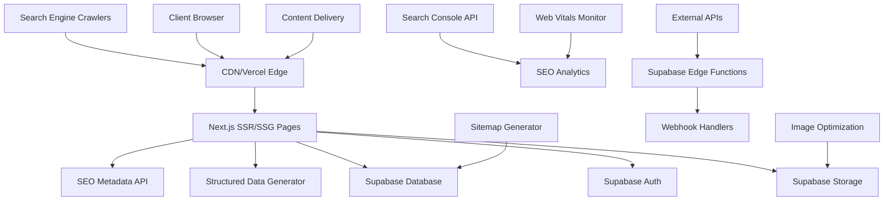

# HitTags - Global Sosyal Bookmark Platformu Tasarım Dokümanı

## Genel Bakış

HitTags, Next.js 14 App Router, Supabase, TailwindCSS, Shadcn/ui ve Framer Motion kullanarak geliştirilecek modern bir sosyal bookmark platformudur. Platform, **SEO-first yaklaşım**, performans optimizasyonu ve kullanıcı deneyimi odaklı olarak tasarlanmıştır.

**SEO Strategy Integration:** Bu tasarım SEO-Strategy.md dosyasındaki kapsamlı SEO planını takip eder ve premium content için teaser approach kullanır.

## SEO-First Mimari Stratejisi

### Temel SEO Prensipleri
- **Server-Side Rendering (SSR)** tüm public sayfalar için
- **Static Site Generation (SSG)** yüksek trafikli içerik için
- **Incremental Static Regeneration (ISR)** dinamik içerik için
- **Mükemmel Core Web Vitals** skorları (LCP < 2.5s, FID < 100ms, CLS < 0.1)
- **Semantic HTML** yapısı ve doğru heading hiyerarşisi
- **Schema.org structured data** rich snippets için
- **Open Graph** ve **Twitter Cards** optimizasyonu
- **Canonical URLs** ve doğru URL yapısı
- **XML Sitemaps** otomatik güncellemeler ile
- **Robots.txt** optimizasyonu

## Mimari

### Teknoloji Stack'i

**Frontend (SEO-Optimize):**
- Next.js 14 (App Router) - SSR/SSG/ISR desteği ile
- TypeScript - Tip güvenliği için
- TailwindCSS - Utility-first CSS framework
- Shadcn/ui - Önceden oluşturulmuş erişilebilir UI bileşenleri
- Framer Motion - Animasyonlar ve geçişler
- React Hook Form + Zod - Form yönetimi ve validasyon

**Backend & Database:**
- Supabase - PostgreSQL database, authentication, real-time subscriptions
- Supabase Edge Functions - Serverless functions
- Supabase Storage - Dosya depolama (avatarlar, kapak görselleri)

**SEO & Performance (Öncelik Odağı):**
- Next.js Metadata API - Dinamik meta tags oluşturma
- Structured Data (JSON-LD) - Rich snippets ve arama özellikleri
- Otomatik Sitemap Oluşturma - Gerçek zamanlı sitemap güncellemeleri
- Image Optimization - Next.js Image component WebP/AVIF ile
- CDN - Vercel Edge Network global performans için
- Web Vitals Optimization - Core Web Vitals monitoring
- Semantic HTML - Doğru heading hiyerarşisi ve landmarks
- Accessibility (a11y) - WCAG 2.1 AA uyumluluğu

**SEO Araçları & Analytics:**
- Google Search Console Entegrasyonu
- Google Analytics 4 - Enhanced ecommerce tracking
- Vercel Analytics - Performance monitoring
- PostHog - User analytics and feature flags
- Sentry - Error tracking and performance monitoring
- Lighthouse CI - Automated performance testing

### SEO-Optimized URL Yapısı ve Site Mimarisi

#### URL Hiyerarşisi ve SEO Stratejisi

```
Domain: hittags.com

🎯 HIGH-PRIORITY SEO PAGES (SSG/ISR):
├── / (Homepage - SSG)
│   ├── Title: "HitTags - Discover, Save & Share the Best Web Resources"
│   ├── Meta: "Social bookmarking platform for discovering and organizing web resources. Join thousands of users sharing curated content."
│   └── Schema: WebSite + SearchAction
│
├── /explore (Discover - ISR every 1 hour)
│   ├── Title: "Explore Trending Bookmarks & Collections | HitTags"
│   ├── Meta: "Discover trending bookmarks, popular collections, and rising creators on HitTags."
│   └── Schema: CollectionPage
│
├── /trending (Trending - ISR every 30 minutes)
│   ├── Title: "Trending Bookmarks Today | HitTags"
│   ├── Meta: "See what's trending now. Most popular bookmarks and collections shared today."
│   └── Schema: ItemList
│
🏷️ TAG PAGES (High SEO Value - SSG/ISR):
├── /tags (Tag directory - ISR daily)
│   ├── Title: "Browse All Topics & Tags | HitTags"
│   ├── Meta: "Explore bookmarks by topic. Find resources in web development, design, marketing, and more."
│   └── Schema: CollectionPage
│
├── /tags/[slug] (Individual tag pages - SSG/ISR)
│   ├── Title: "{TagName} Bookmarks & Resources | HitTags"
│   ├── Meta: "Discover {count}+ curated {TagName} bookmarks. Best {TagName} tools, articles, and resources."
│   ├── Schema: CollectionPage + BreadcrumbList
│   └── URL Examples:
│       ├── /tags/web-development
│       ├── /tags/ui-design
│       ├── /tags/javascript
│       └── /tags/marketing-tools
│
👥 USER PROFILES (Medium SEO Value - ISR):
├── /users/[username] (Public profiles - ISR)
│   ├── Title: "{DisplayName} (@{username}) | HitTags Profile"
│   ├── Meta: "{DisplayName}'s curated bookmarks and collections. {BookmarkCount} bookmarks, {FollowerCount} followers."
│   ├── Schema: ProfilePage + Person
│   └── Canonical: /users/{username}
│
├── /users/[username]/bookmarks (User bookmarks - ISR)
│   ├── Title: "{DisplayName}'s Bookmarks | HitTags"
│   ├── Meta: "Browse {DisplayName}'s {count} curated bookmarks and saved resources."
│   └── Schema: CollectionPage
│
├── /users/[username]/collections (User collections - ISR)
│   ├── Title: "{DisplayName}'s Collections | HitTags"
│   ├── Meta: "Explore {DisplayName}'s {count} bookmark collections and curated lists."
│   └── Schema: CollectionPage
│
📚 COLLECTIONS (High SEO Value - SSG/ISR):
├── /collections (Collections directory - ISR)
│   ├── Title: "Popular Bookmark Collections | HitTags"
│   ├── Meta: "Discover curated bookmark collections. Find organized resources for any topic or project."
│   └── Schema: CollectionPage
│
├── /collections/[slug] (Individual collections - SSG/ISR)
│   ├── Title: "{CollectionName} - Curated by {Username} | HitTags"
│   ├── Meta: "{Description} - {BookmarkCount} carefully selected bookmarks by {Username}."
│   ├── Schema: CollectionPage + BreadcrumbList
│   └── URL Examples:
│       ├── /collections/best-design-tools-2024
│       ├── /collections/javascript-learning-resources
│       └── /collections/startup-growth-hacks
│
🔗 LINK GROUPS (Medium SEO Value - SSG/ISR):
├── /link-groups/[slug] (Linktree-style pages - SSG/ISR)
│   ├── Title: "{Title} - {Username}'s Links | HitTags"
│   ├── Meta: "{Description} - All important links from {Username} in one place."
│   ├── Schema: ProfilePage + ItemList
│   └── URL Examples:
│       ├── /link-groups/john-doe-links
│       ├── /link-groups/design-agency-portfolio
│       └── /link-groups/startup-founder-resources
│
📖 CONTENT MARKETING (High SEO Value - SSG):
├── /blog (Blog - SSG)
│   ├── Title: "HitTags Blog - Bookmark Management & Productivity Tips"
│   ├── Meta: "Learn bookmark organization, productivity tips, and discover the best web resources."
│   └── Schema: Blog
│
├── /blog/[slug] (Blog posts - SSG)
│   ├── Title: "{PostTitle} | HitTags Blog"
│   ├── Meta: "{Excerpt}"
│   └── Schema: BlogPosting + BreadcrumbList
│
├── /guides (How-to guides - SSG)
│   ├── Title: "Bookmark Management Guides | HitTags"
│   ├── Meta: "Step-by-step guides for organizing bookmarks, building collections, and maximizing productivity."
│   └── Schema: HowTo + FAQPage
│
🔍 SEARCH & DISCOVERY:
├── /search (Search results - SSR)
│   ├── Title: "Search Results for '{query}' | HitTags"
│   ├── Meta: "Find bookmarks, collections, and users related to '{query}' on HitTags."
│   └── Schema: SearchResultsPage
│
🔒 PRIVATE PAGES (SSR - No SEO):
├── /dashboard (User dashboard)
├── /settings (User settings)
├── /analytics (User analytics)
├── /add-bookmark (Add bookmark)
└── /admin/* (Admin panel)
```

#### SEO URL Optimizasyon Kuralları

```typescript
// lib/seo/url-optimization.ts
export class SEOUrlOptimizer {
  // Slug oluşturma kuralları
  static generateSEOSlug(title: string): string {
    return title
      .toLowerCase()
      .replace(/[^a-z0-9\s-]/g, '') // Özel karakterleri kaldır
      .replace(/\s+/g, '-') // Boşlukları tire ile değiştir
      .replace(/-+/g, '-') // Çoklu tireleri tek tire yap
      .replace(/^-|-$/g, '') // Başta ve sonda tire varsa kaldır
      .substring(0, 60); // Max 60 karakter
  }
  
  // Canonical URL oluşturma
  static generateCanonicalUrl(path: string): string {
    return `https://hittags.com${path}`;
  }
  
  // Breadcrumb oluşturma
  static generateBreadcrumbs(path: string): BreadcrumbItem[] {
    const segments = path.split('/').filter(Boolean);
    const breadcrumbs: BreadcrumbItem[] = [
      { name: 'Home', url: '/' }
    ];
    
    let currentPath = '';
    segments.forEach((segment, index) => {
      currentPath += `/${segment}`;
      breadcrumbs.push({
        name: this.formatBreadcrumbName(segment),
        url: currentPath,
        isLast: index === segments.length - 1
      });
    });
    
    return breadcrumbs;
  }
}
```

### Sistem Mimarisi



## Bileşenler ve Arayüzler

### Veritabanı Şeması

```sql
-- Kullanıcılar
CREATE TABLE profiles (
  id UUID REFERENCES auth.users PRIMARY KEY,
  username TEXT UNIQUE NOT NULL,
  display_name TEXT,
  bio TEXT,
  avatar_url TEXT,
  website_url TEXT,
  twitter_handle TEXT,
  github_handle TEXT,
  is_premium BOOLEAN DEFAULT FALSE,
  is_verified BOOLEAN DEFAULT FALSE,
  created_at TIMESTAMP WITH TIME ZONE DEFAULT NOW(),
  updated_at TIMESTAMP WITH TIME ZONE DEFAULT NOW()
);

-- Bookmarklar
CREATE TABLE bookmarks (
  id UUID PRIMARY KEY DEFAULT gen_random_uuid(),
  user_id UUID REFERENCES profiles(id) ON DELETE CASCADE,
  url TEXT NOT NULL,
  title TEXT NOT NULL,
  description TEXT,
  favicon_url TEXT,
  preview_image_url TEXT,
  is_public BOOLEAN DEFAULT TRUE,
  is_featured BOOLEAN DEFAULT FALSE,
  view_count INTEGER DEFAULT 0,
  like_count INTEGER DEFAULT 0,
  comment_count INTEGER DEFAULT 0,
  created_at TIMESTAMP WITH TIME ZONE DEFAULT NOW(),
  updated_at TIMESTAMP WITH TIME ZONE DEFAULT NOW()
);

-- Etiketler
CREATE TABLE tags (
  id UUID PRIMARY KEY DEFAULT gen_random_uuid(),
  name TEXT UNIQUE NOT NULL,
  slug TEXT UNIQUE NOT NULL,
  description TEXT,
  color TEXT DEFAULT '#3b82f6',
  usage_count INTEGER DEFAULT 0,
  is_trending BOOLEAN DEFAULT FALSE,
  created_at TIMESTAMP WITH TIME ZONE DEFAULT NOW()
);

-- Bookmark-Etiket İlişkisi
CREATE TABLE bookmark_tags (
  bookmark_id UUID REFERENCES bookmarks(id) ON DELETE CASCADE,
  tag_id UUID REFERENCES tags(id) ON DELETE CASCADE,
  PRIMARY KEY (bookmark_id, tag_id)
);

-- Koleksiyonlar
CREATE TABLE collections (
  id UUID PRIMARY KEY DEFAULT gen_random_uuid(),
  user_id UUID REFERENCES profiles(id) ON DELETE CASCADE,
  name TEXT NOT NULL,
  slug TEXT NOT NULL,
  description TEXT,
  cover_image_url TEXT,
  is_public BOOLEAN DEFAULT TRUE,
  is_collaborative BOOLEAN DEFAULT FALSE,
  bookmark_count INTEGER DEFAULT 0,
  follower_count INTEGER DEFAULT 0,
  created_at TIMESTAMP WITH TIME ZONE DEFAULT NOW(),
  updated_at TIMESTAMP WITH TIME ZONE DEFAULT NOW(),
  UNIQUE(user_id, slug)
);

-- Koleksiyon-Bookmark İlişkisi
CREATE TABLE collection_bookmarks (
  collection_id UUID REFERENCES collections(id) ON DELETE CASCADE,
  bookmark_id UUID REFERENCES bookmarks(id) ON DELETE CASCADE,
  added_at TIMESTAMP WITH TIME ZONE DEFAULT NOW(),
  PRIMARY KEY (collection_id, bookmark_id)
);

-- Takip İlişkileri
CREATE TABLE follows (
  follower_id UUID REFERENCES profiles(id) ON DELETE CASCADE,
  following_id UUID REFERENCES profiles(id) ON DELETE CASCADE,
  created_at TIMESTAMP WITH TIME ZONE DEFAULT NOW(),
  PRIMARY KEY (follower_id, following_id)
);

-- Beğeniler
CREATE TABLE likes (
  user_id UUID REFERENCES profiles(id) ON DELETE CASCADE,
  bookmark_id UUID REFERENCES bookmarks(id) ON DELETE CASCADE,
  created_at TIMESTAMP WITH TIME ZONE DEFAULT NOW(),
  PRIMARY KEY (user_id, bookmark_id)
);

-- Yorumlar
CREATE TABLE comments (
  id UUID PRIMARY KEY DEFAULT gen_random_uuid(),
  user_id UUID REFERENCES profiles(id) ON DELETE CASCADE,
  bookmark_id UUID REFERENCES bookmarks(id) ON DELETE CASCADE,
  content TEXT NOT NULL,
  created_at TIMESTAMP WITH TIME ZONE DEFAULT NOW(),
  updated_at TIMESTAMP WITH TIME ZONE DEFAULT NOW()
);

-- Premium Abonelikler
CREATE TABLE subscriptions (
  id UUID PRIMARY KEY DEFAULT gen_random_uuid(),
  user_id UUID REFERENCES profiles(id) ON DELETE CASCADE,
  stripe_subscription_id TEXT UNIQUE,
  status TEXT NOT NULL,
  plan_type TEXT NOT NULL CHECK (plan_type IN ('free', 'pro', 'enterprise')),
  current_period_start TIMESTAMP WITH TIME ZONE,
  current_period_end TIMESTAMP WITH TIME ZONE,
  created_at TIMESTAMP WITH TIME ZONE DEFAULT NOW()
);

-- Affiliate Linkler
CREATE TABLE affiliate_links (
  id UUID PRIMARY KEY DEFAULT gen_random_uuid(),
  bookmark_id UUID REFERENCES bookmarks(id) ON DELETE CASCADE,
  user_id UUID REFERENCES profiles(id) ON DELETE CASCADE,
  original_url TEXT NOT NULL,
  affiliate_url TEXT NOT NULL,
  commission_rate DECIMAL(5,2) DEFAULT 0.00,
  total_clicks INTEGER DEFAULT 0,
  total_earnings DECIMAL(10,2) DEFAULT 0.00,
  is_active BOOLEAN DEFAULT TRUE,
  created_at TIMESTAMP WITH TIME ZONE DEFAULT NOW()
);

-- Link Tıklama Takibi
CREATE TABLE link_clicks (
  id UUID PRIMARY KEY DEFAULT gen_random_uuid(),
  affiliate_link_id UUID REFERENCES affiliate_links(id) ON DELETE CASCADE,
  user_id UUID REFERENCES profiles(id) ON DELETE SET NULL,
  ip_address INET,
  user_agent TEXT,
  referrer TEXT,
  country_code TEXT,
  device_type TEXT,
  clicked_at TIMESTAMP WITH TIME ZONE DEFAULT NOW()
);

-- Link Grupları (Linktree benzeri)
CREATE TABLE link_groups (
  id UUID PRIMARY KEY DEFAULT gen_random_uuid(),
  user_id UUID REFERENCES profiles(id) ON DELETE CASCADE,
  title TEXT NOT NULL,
  slug TEXT UNIQUE NOT NULL,
  description TEXT,
  avatar_url TEXT,
  theme_color TEXT DEFAULT '#3b82f6',
  background_type TEXT DEFAULT 'solid',
  background_value TEXT DEFAULT '#ffffff',
  is_public BOOLEAN DEFAULT TRUE,
  view_count INTEGER DEFAULT 0,
  click_count INTEGER DEFAULT 0,
  created_at TIMESTAMP WITH TIME ZONE DEFAULT NOW(),
  updated_at TIMESTAMP WITH TIME ZONE DEFAULT NOW()
);

-- Link Grup İçerikleri
CREATE TABLE link_group_items (
  id UUID PRIMARY KEY DEFAULT gen_random_uuid(),
  link_group_id UUID REFERENCES link_groups(id) ON DELETE CASCADE,
  title TEXT NOT NULL,
  url TEXT NOT NULL,
  description TEXT,
  icon_url TEXT,
  position INTEGER NOT NULL,
  is_active BOOLEAN DEFAULT TRUE,
  click_count INTEGER DEFAULT 0,
  created_at TIMESTAMP WITH TIME ZONE DEFAULT NOW()
);

-- Abone İlişkileri
CREATE TABLE subscriptions_user (
  id UUID PRIMARY KEY DEFAULT gen_random_uuid(),
  subscriber_id UUID REFERENCES profiles(id) ON DELETE CASCADE,
  subscribed_to_id UUID REFERENCES profiles(id) ON DELETE CASCADE,
  notification_enabled BOOLEAN DEFAULT TRUE,
  created_at TIMESTAMP WITH TIME ZONE DEFAULT NOW(),
  UNIQUE(subscriber_id, subscribed_to_id)
);

-- Özel İçerik Paylaşımları
CREATE TABLE exclusive_posts (
  id UUID PRIMARY KEY DEFAULT gen_random_uuid(),
  user_id UUID REFERENCES profiles(id) ON DELETE CASCADE,
  title TEXT NOT NULL,
  content TEXT NOT NULL,
  content_type TEXT DEFAULT 'text' CHECK (content_type IN ('text', 'image', 'video', 'link')),
  media_url TEXT,
  is_subscribers_only BOOLEAN DEFAULT FALSE,
  view_count INTEGER DEFAULT 0,
  like_count INTEGER DEFAULT 0,
  comment_count INTEGER DEFAULT 0,
  created_at TIMESTAMP WITH TIME ZONE DEFAULT NOW(),
  updated_at TIMESTAMP WITH TIME ZONE DEFAULT NOW()
);

-- Tag Linkler (Premium özellik)
CREATE TABLE tag_links (
  id UUID PRIMARY KEY DEFAULT gen_random_uuid(),
  tag_id UUID REFERENCES tags(id) ON DELETE CASCADE,
  user_id UUID REFERENCES profiles(id) ON DELETE CASCADE,
  url TEXT NOT NULL,
  title TEXT NOT NULL,
  description TEXT,
  is_active BOOLEAN DEFAULT TRUE,
  click_count INTEGER DEFAULT 0,
  created_at TIMESTAMP WITH TIME ZONE DEFAULT NOW()
);

-- Analytics Verileri
CREATE TABLE analytics_events (
  id UUID PRIMARY KEY DEFAULT gen_random_uuid(),
  user_id UUID REFERENCES profiles(id) ON DELETE CASCADE,
  event_type TEXT NOT NULL,
  entity_type TEXT NOT NULL,
  entity_id UUID NOT NULL,
  metadata JSONB,
  ip_address INET,
  user_agent TEXT,
  country_code TEXT,
  device_type TEXT,
  created_at TIMESTAMP WITH TIME ZONE DEFAULT NOW()
);
```

### API Rotaları

**Authentication Routes:**
- `POST /api/auth/signup` - Kullanıcı kaydı
- `POST /api/auth/signin` - Giriş
- `POST /api/auth/signout` - Çıkış
- `POST /api/auth/reset-password` - Şifre sıfırlama

**Bookmark Routes:**
- `GET /api/bookmarks` - Bookmark listesi (filtreleme, sayfalama)
- `POST /api/bookmarks` - Yeni bookmark oluşturma
- `GET /api/bookmarks/[id]` - Tekil bookmark
- `PUT /api/bookmarks/[id]` - Bookmark güncelleme
- `DELETE /api/bookmarks/[id]` - Bookmark silme
- `POST /api/bookmarks/[id]/like` - Bookmark beğenme
- `POST /api/bookmarks/fetch-metadata` - URL metadata çekme

**Collection Routes:**
- `GET /api/collections` - Koleksiyon listesi
- `POST /api/collections` - Yeni koleksiyon
- `GET /api/collections/[slug]` - Tekil koleksiyon
- `PUT /api/collections/[id]` - Koleksiyon güncelleme
- `POST /api/collections/[id]/bookmarks` - Koleksiyona bookmark ekleme

**Tag Routes:**
- `GET /api/tags` - Etiket listesi
- `GET /api/tags/[slug]` - Etiket detayı
- `GET /api/tags/trending` - Trend etiketler
- `GET /api/tags/suggestions` - Etiket önerileri

**User Routes:**
- `GET /api/users/[username]` - Kullanıcı profili
- `PUT /api/users/profile` - Profil güncelleme
- `POST /api/users/[id]/follow` - Kullanıcı takip etme
- `POST /api/users/[id]/subscribe` - Kullanıcıya abone olma
- `GET /api/users/[username]/bookmarks` - Kullanıcı bookmarkları
- `GET /api/users/[username]/collections` - Kullanıcı koleksiyonları
- `GET /api/users/[username]/exclusive-posts` - Özel içerikler (sadece aboneler)

**Affiliate Routes:**
- `POST /api/affiliate/links` - Affiliate link oluşturma
- `GET /api/affiliate/links` - Kullanıcının affiliate linkleri
- `GET /api/affiliate/analytics` - Affiliate performans verileri
- `POST /api/affiliate/track-click` - Link tıklama takibi
- `GET /api/affiliate/earnings` - Kazanç raporları

**Link Group Routes:**
- `GET /api/link-groups` - Link grupları listesi
- `POST /api/link-groups` - Yeni link grubu oluşturma
- `GET /api/link-groups/[slug]` - Link grubu detayı
- `PUT /api/link-groups/[id]` - Link grubu güncelleme
- `POST /api/link-groups/[id]/items` - Link grubu item ekleme
- `PUT /api/link-groups/[id]/items/[itemId]` - Link item güncelleme
- `POST /api/link-groups/[id]/track-click` - Link tıklama takibi

**Subscription Routes:**
- `GET /api/subscriptions/plans` - Abonelik planları
- `POST /api/subscriptions/create` - Yeni abonelik oluşturma
- `PUT /api/subscriptions/upgrade` - Plan yükseltme
- `POST /api/subscriptions/cancel` - Abonelik iptali
- `GET /api/subscriptions/current` - Mevcut abonelik durumu

**Exclusive Content Routes:**
- `GET /api/exclusive-posts` - Özel içerikler (abone akışı)
- `POST /api/exclusive-posts` - Yeni özel içerik oluşturma
- `GET /api/exclusive-posts/[id]` - Özel içerik detayı
- `PUT /api/exclusive-posts/[id]` - Özel içerik güncelleme
- `DELETE /api/exclusive-posts/[id]` - Özel içerik silme

**Analytics Routes:**
- `GET /api/analytics/overview` - Genel analitik özeti
- `GET /api/analytics/bookmarks` - Bookmark analitikleri
- `GET /api/analytics/link-groups` - Link grubu analitikleri
- `GET /api/analytics/affiliate` - Affiliate analitikleri
- `GET /api/analytics/audience` - Takipçi analitikleri
- `POST /api/analytics/track-event` - Event takibi

**Tag Link Routes:**
- `POST /api/tags/[slug]/links` - Tag'e link ekleme (Premium)
- `GET /api/tags/[slug]/links` - Tag linkleri
- `PUT /api/tags/[slug]/links/[id]` - Tag link güncelleme
- `DELETE /api/tags/[slug]/links/[id]` - Tag link silme

### UI Bileşen Yapısı

**Layout Bileşenleri:**
```typescript
// components/layout/
├── Header.tsx              // Ana navigasyon
├── Sidebar.tsx            // Yan menü
├── Footer.tsx             // Alt bilgi
├── MobileNav.tsx          // Mobil navigasyon
└── AuthGuard.tsx          // Kimlik doğrulama koruması
```

**Bookmark Bileşenleri:**
```typescript
// components/bookmark/
├── BookmarkCard.tsx       // Bookmark kartı
├── BookmarkGrid.tsx       // Bookmark grid görünümü
├── BookmarkList.tsx       // Bookmark liste görünümü
├── BookmarkForm.tsx       // Bookmark ekleme/düzenleme formu
├── BookmarkActions.tsx    // Beğeni, yorum, paylaş butonları
└── BookmarkPreview.tsx    // URL önizleme
```

**Collection Bileşenleri:**
```typescript
// components/collection/
├── CollectionCard.tsx     // Koleksiyon kartı
├── CollectionGrid.tsx     // Koleksiyon grid
├── CollectionForm.tsx     // Koleksiyon formu
├── CollectionHeader.tsx   // Koleksiyon başlığı
└── CollectionStats.tsx    // Koleksiyon istatistikleri
```

**Affiliate Bileşenleri:**
```typescript
// components/affiliate/
├── AffiliateForm.tsx      // Affiliate link oluşturma formu
├── AffiliateStats.tsx     // Affiliate istatistikleri
├── ClickTracker.tsx       // Tıklama takip bileşeni
├── EarningsChart.tsx      // Kazanç grafikleri
└── CommissionSettings.tsx // Komisyon ayarları
```

**Link Group Bileşenleri:**
```typescript
// components/link-group/
├── LinkGroupBuilder.tsx   // Link grubu oluşturucu
├── LinkGroupPreview.tsx   // Link grubu önizleme
├── LinkGroupPublic.tsx    // Genel link grubu sayfası
├── LinkItemEditor.tsx     // Link item düzenleyici
├── ThemeCustomizer.tsx    // Tema özelleştirici
└── LinkGroupAnalytics.tsx // Link grubu analitikleri
```

**Subscription Bileşenleri:**
```typescript
// components/subscription/
├── PlanSelector.tsx       // Plan seçici
├── PlanComparison.tsx     // Plan karşılaştırma tablosu
├── SubscriptionStatus.tsx // Abonelik durumu
├── PaymentForm.tsx        // Ödeme formu
└── UsageIndicator.tsx     // Kullanım göstergesi
```

**Exclusive Content Bileşenleri:**
```typescript
// components/exclusive/
├── ExclusivePostForm.tsx  // Özel içerik formu
├── ExclusivePostCard.tsx  // Özel içerik kartı
├── SubscriberFeed.tsx     // Abone akışı
├── SubscriptionButton.tsx // Abone olma butonu
└── ExclusiveContentGate.tsx // İçerik erişim kontrolü
```

**Analytics Bileşenleri:**
```typescript
// components/analytics/
├── AnalyticsDashboard.tsx // Ana analitik paneli
├── MetricsCard.tsx        // Metrik kartları
├── ChartContainer.tsx     // Grafik konteyneri
├── DateRangePicker.tsx    // Tarih aralığı seçici
├── ExportButton.tsx       // Veri dışa aktarma
└── RealtimeStats.tsx      // Gerçek zamanlı istatistikler
```

**UI Bileşenleri (Shadcn/ui tabanlı):**
```typescript
// components/ui/
├── Button.tsx             // Buton bileşeni
├── Input.tsx              // Giriş alanı
├── Card.tsx               // Kart bileşeni
├── Dialog.tsx             // Modal dialog
├── Dropdown.tsx           // Açılır menü
├── Avatar.tsx             // Kullanıcı avatarı
├── Badge.tsx              // Etiket rozeti
├── Tabs.tsx               // Sekme bileşeni
├── Pagination.tsx         // Sayfalama
├── LoadingSpinner.tsx     // Yükleme animasyonu
├── Chart.tsx              // Grafik bileşeni
├── Switch.tsx             // Anahtar bileşeni
├── Slider.tsx             // Kaydırıcı bileşeni
├── ColorPicker.tsx        // Renk seçici
└── QRCode.tsx             // QR kod bileşeni
```

## Veri Modelleri

### TypeScript Tipleri

```typescript
// types/database.ts
export interface Profile {
  id: string;
  username: string;
  display_name?: string;
  bio?: string;
  avatar_url?: string;
  website_url?: string;
  twitter_handle?: string;
  github_handle?: string;
  is_premium: boolean;
  is_verified: boolean;
  plan_type: 'free' | 'pro' | 'enterprise';
  bookmark_limit: number;
  subscriber_count: number;
  subscription_count: number;
  created_at: string;
  updated_at: string;
}

export interface Bookmark {
  id: string;
  user_id: string;
  url: string;
  title: string;
  description?: string;
  favicon_url?: string;
  preview_image_url?: string;
  is_public: boolean;
  is_featured: boolean;
  view_count: number;
  like_count: number;
  comment_count: number;
  created_at: string;
  updated_at: string;
  tags?: Tag[];
  user?: Profile;
  is_liked?: boolean;
  affiliate_link?: AffiliateLink;
}

export interface Collection {
  id: string;
  user_id: string;
  name: string;
  slug: string;
  description?: string;
  cover_image_url?: string;
  is_public: boolean;
  is_collaborative: boolean;
  bookmark_count: number;
  follower_count: number;
  created_at: string;
  updated_at: string;
  user?: Profile;
  bookmarks?: Bookmark[];
}

export interface Tag {
  id: string;
  name: string;
  slug: string;
  description?: string;
  color: string;
  usage_count: number;
  is_trending: boolean;
  created_at: string;
  tag_links?: TagLink[];
}

export interface AffiliateLink {
  id: string;
  bookmark_id: string;
  user_id: string;
  original_url: string;
  affiliate_url: string;
  commission_rate: number;
  total_clicks: number;
  total_earnings: number;
  is_active: boolean;
  created_at: string;
}

export interface LinkClick {
  id: string;
  affiliate_link_id: string;
  user_id?: string;
  ip_address: string;
  user_agent: string;
  referrer?: string;
  country_code?: string;
  device_type?: string;
  clicked_at: string;
}

export interface LinkGroup {
  id: string;
  user_id: string;
  title: string;
  slug: string;
  description?: string;
  avatar_url?: string;
  theme_color: string;
  background_type: 'solid' | 'gradient' | 'image';
  background_value: string;
  is_public: boolean;
  view_count: number;
  click_count: number;
  created_at: string;
  updated_at: string;
  items?: LinkGroupItem[];
  user?: Profile;
}

export interface LinkGroupItem {
  id: string;
  link_group_id: string;
  title: string;
  url: string;
  description?: string;
  icon_url?: string;
  position: number;
  is_active: boolean;
  click_count: number;
  created_at: string;
}

export interface ExclusivePost {
  id: string;
  user_id: string;
  title: string;
  content: string;
  content_type: 'text' | 'image' | 'video' | 'link';
  media_url?: string;
  is_subscribers_only: boolean;
  view_count: number;
  like_count: number;
  comment_count: number;
  created_at: string;
  updated_at: string;
  user?: Profile;
}

export interface TagLink {
  id: string;
  tag_id: string;
  user_id: string;
  url: string;
  title: string;
  description?: string;
  is_active: boolean;
  click_count: number;
  created_at: string;
  user?: Profile;
}

export interface AnalyticsEvent {
  id: string;
  user_id: string;
  event_type: string;
  entity_type: string;
  entity_id: string;
  metadata?: Record<string, any>;
  ip_address?: string;
  user_agent?: string;
  country_code?: string;
  device_type?: string;
  created_at: string;
}

export interface SubscriptionPlan {
  id: string;
  name: string;
  price: number;
  interval: 'month' | 'year';
  features: string[];
  bookmark_limit: number;
  is_popular: boolean;
}
```

### Zod Validation Şemaları

```typescript
// lib/validations.ts
import { z } from 'zod';

export const bookmarkSchema = z.object({
  url: z.string().url('Geçerli bir URL giriniz'),
  title: z.string().min(1, 'Başlık gereklidir').max(200, 'Başlık çok uzun'),
  description: z.string().max(500, 'Açıklama çok uzun').optional(),
  tags: z.array(z.string()).max(10, 'En fazla 10 etiket ekleyebilirsiniz'),
  collection_id: z.string().uuid().optional(),
  is_public: z.boolean().default(true),
  affiliate_url: z.string().url().optional(),
  commission_rate: z.number().min(0).max(100).optional()
});

export const collectionSchema = z.object({
  name: z.string().min(1, 'Koleksiyon adı gereklidir').max(100, 'Ad çok uzun'),
  description: z.string().max(500, 'Açıklama çok uzun').optional(),
  is_public: z.boolean().default(true),
  is_collaborative: z.boolean().default(false)
});

export const profileSchema = z.object({
  display_name: z.string().max(50, 'İsim çok uzun').optional(),
  bio: z.string().max(160, 'Bio çok uzun').optional(),
  website_url: z.string().url('Geçerli URL giriniz').optional().or(z.literal('')),
  twitter_handle: z.string().max(15, 'Twitter handle çok uzun').optional(),
  github_handle: z.string().max(39, 'GitHub handle çok uzun').optional()
});

export const linkGroupSchema = z.object({
  title: z.string().min(1, 'Başlık gereklidir').max(100, 'Başlık çok uzun'),
  slug: z.string().min(1, 'Slug gereklidir').max(50, 'Slug çok uzun')
    .regex(/^[a-z0-9-]+$/, 'Slug sadece küçük harf, rakam ve tire içerebilir'),
  description: z.string().max(200, 'Açıklama çok uzun').optional(),
  theme_color: z.string().regex(/^#[0-9A-F]{6}$/i, 'Geçerli hex renk kodu giriniz'),
  background_type: z.enum(['solid', 'gradient', 'image']),
  background_value: z.string().min(1, 'Arka plan değeri gereklidir'),
  is_public: z.boolean().default(true)
});

export const linkGroupItemSchema = z.object({
  title: z.string().min(1, 'Başlık gereklidir').max(100, 'Başlık çok uzun'),
  url: z.string().url('Geçerli bir URL giriniz'),
  description: z.string().max(200, 'Açıklama çok uzun').optional(),
  position: z.number().int().min(0, 'Pozisyon 0 veya daha büyük olmalı')
});

export const exclusivePostSchema = z.object({
  title: z.string().min(1, 'Başlık gereklidir').max(200, 'Başlık çok uzun'),
  content: z.string().min(1, 'İçerik gereklidir').max(5000, 'İçerik çok uzun'),
  content_type: z.enum(['text', 'image', 'video', 'link']),
  media_url: z.string().url().optional(),
  is_subscribers_only: z.boolean().default(false)
});

export const affiliateLinkSchema = z.object({
  original_url: z.string().url('Geçerli bir URL giriniz'),
  affiliate_url: z.string().url('Geçerli bir affiliate URL giriniz'),
  commission_rate: z.number().min(0, 'Komisyon oranı 0 veya daha büyük olmalı')
    .max(100, 'Komisyon oranı 100\'den küçük olmalı')
});

export const tagLinkSchema = z.object({
  url: z.string().url('Geçerli bir URL giriniz'),
  title: z.string().min(1, 'Başlık gereklidir').max(100, 'Başlık çok uzun'),
  description: z.string().max(200, 'Açıklama çok uzun').optional()
});
```

## Hata Yönetimi

### Error Boundary Bileşeni

```typescript
// components/ErrorBoundary.tsx
'use client';

import React from 'react';
import { Button } from '@/components/ui/Button';

interface ErrorBoundaryState {
  hasError: boolean;
  error?: Error;
}

export class ErrorBoundary extends React.Component<
  React.PropsWithChildren<{}>,
  ErrorBoundaryState
> {
  constructor(props: React.PropsWithChildren<{}>) {
    super(props);
    this.state = { hasError: false };
  }

  static getDerivedStateFromError(error: Error): ErrorBoundaryState {
    return { hasError: true, error };
  }

  componentDidCatch(error: Error, errorInfo: React.ErrorInfo) {
    console.error('Error caught by boundary:', error, errorInfo);
    // Sentry'ye hata gönder
  }

  render() {
    if (this.state.hasError) {
      return (
        <div className="flex flex-col items-center justify-center min-h-[400px] p-8">
          <h2 className="text-2xl font-bold mb-4">Bir şeyler ters gitti</h2>
          <p className="text-gray-600 mb-6 text-center">
            Beklenmeyen bir hata oluştu. Lütfen sayfayı yenileyin.
          </p>
          <Button onClick={() => window.location.reload()}>
            Sayfayı Yenile
          </Button>
        </div>
      );
    }

    return this.props.children;
  }
}
```

### API Error Handling

```typescript
// lib/api-client.ts
export class ApiError extends Error {
  constructor(
    message: string,
    public status: number,
    public code?: string
  ) {
    super(message);
    this.name = 'ApiError';
  }
}

export async function apiRequest<T>(
  url: string,
  options?: RequestInit
): Promise<T> {
  try {
    const response = await fetch(url, {
      headers: {
        'Content-Type': 'application/json',
        ...options?.headers,
      },
      ...options,
    });

    if (!response.ok) {
      const errorData = await response.json().catch(() => ({}));
      throw new ApiError(
        errorData.message || 'Bir hata oluştu',
        response.status,
        errorData.code
      );
    }

    return response.json();
  } catch (error) {
    if (error instanceof ApiError) {
      throw error;
    }
    throw new ApiError('Ağ hatası oluştu', 0);
  }
}
```

## Test Stratejisi

### Unit Tests (Jest + React Testing Library)

```typescript
// __tests__/components/BookmarkCard.test.tsx
import { render, screen, fireEvent } from '@testing-library/react';
import { BookmarkCard } from '@/components/bookmark/BookmarkCard';

const mockBookmark = {
  id: '1',
  title: 'Test Bookmark',
  url: 'https://example.com',
  description: 'Test description',
  like_count: 5,
  is_liked: false,
  user: { username: 'testuser', avatar_url: null },
  tags: [{ name: 'test', slug: 'test', color: '#blue' }]
};

describe('BookmarkCard', () => {
  it('renders bookmark information correctly', () => {
    render(<BookmarkCard bookmark={mockBookmark} />);
    
    expect(screen.getByText('Test Bookmark')).toBeInTheDocument();
    expect(screen.getByText('Test description')).toBeInTheDocument();
    expect(screen.getByText('5')).toBeInTheDocument();
  });

  it('handles like button click', () => {
    const onLike = jest.fn();
    render(<BookmarkCard bookmark={mockBookmark} onLike={onLike} />);
    
    fireEvent.click(screen.getByRole('button', { name: /like/i }));
    expect(onLike).toHaveBeenCalledWith(mockBookmark.id);
  });
});
```

### Integration Tests (Playwright)

```typescript
// e2e/bookmark-flow.spec.ts
import { test, expect } from '@playwright/test';

test.describe('Bookmark Management', () => {
  test.beforeEach(async ({ page }) => {
    // Login işlemi
    await page.goto('/login');
    await page.fill('[data-testid=email]', 'test@example.com');
    await page.fill('[data-testid=password]', 'password');
    await page.click('[data-testid=login-button]');
  });

  test('should create a new bookmark', async ({ page }) => {
    await page.goto('/add');
    
    await page.fill('[data-testid=url-input]', 'https://example.com');
    await page.click('[data-testid=fetch-button]');
    
    await page.waitForSelector('[data-testid=title-input]');
    await page.fill('[data-testid=description]', 'Test bookmark description');
    
    await page.click('[data-testid=save-button]');
    
    await expect(page).toHaveURL(/\/bookmarks\/\w+/);
    await expect(page.locator('[data-testid=bookmark-title]')).toContainText('Example Domain');
  });
});
```

### Performance Tests

```typescript
// __tests__/performance/bookmark-list.perf.ts
import { performance } from 'perf_hooks';
import { render } from '@testing-library/react';
import { BookmarkGrid } from '@/components/bookmark/BookmarkGrid';

describe('BookmarkGrid Performance', () => {
  it('should render 100 bookmarks within performance budget', () => {
    const bookmarks = Array.from({ length: 100 }, (_, i) => ({
      id: `bookmark-${i}`,
      title: `Bookmark ${i}`,
      url: `https://example${i}.com`,
      like_count: i,
      user: { username: `user${i}` },
      tags: []
    }));

    const startTime = performance.now();
    render(<BookmarkGrid bookmarks={bookmarks} />);
    const endTime = performance.now();

    const renderTime = endTime - startTime;
    expect(renderTime).toBeLessThan(100); // 100ms budget
  });
});
```

## Yeni Özellikler Mimarisi

### Affiliate Sistemi Mimarisi

**Link Takip Sistemi:**
```typescript
// lib/affiliate/tracker.ts
export class AffiliateTracker {
  static async trackClick(affiliateLinkId: string, metadata: ClickMetadata) {
    // IP, user agent, referrer bilgilerini kaydet
    // Gerçek zamanlı analitik güncelle
    // Kazanç hesapla ve kaydet
  }
  
  static async generateTrackingUrl(originalUrl: string, userId: string) {
    // Benzersiz tracking URL oluştur
    // Redirect endpoint'i ile birleştir
  }
}
```

**Kazanç Hesaplama:**
```typescript
// lib/affiliate/earnings.ts
export class EarningsCalculator {
  static calculateCommission(clickData: ClickData, commissionRate: number) {
    // Komisyon hesaplama algoritması
    // Fraud detection kontrolü
    // Minimum payout threshold kontrolü
  }
}
```

### Link Grup Sistemi Mimarisi

**Tema Sistemi:**
```typescript
// lib/link-groups/themes.ts
export interface LinkGroupTheme {
  id: string;
  name: string;
  colors: {
    primary: string;
    secondary: string;
    background: string;
    text: string;
  };
  fonts: {
    heading: string;
    body: string;
  };
  layout: 'minimal' | 'card' | 'button' | 'list';
}

export const defaultThemes: LinkGroupTheme[] = [
  {
    id: 'minimal',
    name: 'Minimal',
    colors: { primary: '#000', secondary: '#666', background: '#fff', text: '#333' },
    fonts: { heading: 'Inter', body: 'Inter' },
    layout: 'minimal'
  }
  // Diğer temalar...
];
```

**QR Kod Oluşturma:**
```typescript
// lib/link-groups/qr-generator.ts
import QRCode from 'qrcode';

export class QRGenerator {
  static async generateQR(url: string, options?: QROptions) {
    return await QRCode.toDataURL(url, {
      width: 300,
      margin: 2,
      color: {
        dark: options?.color || '#000000',
        light: '#FFFFFF'
      }
    });
  }
}
```

### Premium Paket Sistemi

**Özellik Kontrolü:**
```typescript
// lib/subscription/features.ts
export class FeatureGate {
  static canCreateBookmark(user: Profile): boolean {
    const limits = {
      free: 20,
      pro: Infinity,
      enterprise: Infinity
    };
    return user.bookmark_count < limits[user.plan_type];
  }
  
  static canCreateLinkGroup(user: Profile): boolean {
    return ['pro', 'enterprise'].includes(user.plan_type);
  }
  
  static canUseAffiliate(user: Profile): boolean {
    return ['pro', 'enterprise'].includes(user.plan_type);
  }
  
  static canAddTagLinks(user: Profile): boolean {
    return ['pro', 'enterprise'].includes(user.plan_type);
  }
}
```

### Analytics Sistemi

**Gerçek Zamanlı Takip:**
```typescript
// lib/analytics/realtime.ts
export class RealtimeAnalytics {
  static async trackEvent(event: AnalyticsEvent) {
    // Event'i veritabanına kaydet
    // WebSocket ile gerçek zamanlı güncelleme gönder
    // Trend hesaplamalarını güncelle
  }
  
  static async getRealtimeStats(userId: string) {
    // Son 24 saat içindeki aktiviteyi getir
    // Canlı ziyaretçi sayısını hesapla
    // Trend verilerini döndür
  }
}
```

**Veri Dışa Aktarma:**
```typescript
// lib/analytics/export.ts
export class DataExporter {
  static async exportToCSV(userId: string, dateRange: DateRange) {
    // Kullanıcının analitik verilerini CSV formatında dışa aktar
  }
  
  static async exportToPDF(userId: string, reportType: ReportType) {
    // PDF rapor oluştur
  }
}
```

### Abone Sistemi Mimarisi

**Bildirim Sistemi:**
```typescript
// lib/subscription/notifications.ts
export class SubscriptionNotifications {
  static async notifySubscribers(userId: string, content: ExclusivePost) {
    // Abonelere yeni içerik bildirimi gönder
    // Email, push notification, in-app notification
  }
  
  static async getSubscriberFeed(userId: string) {
    // Kullanıcının abone olduğu kişilerin özel içeriklerini getir
    // Kronolojik sıralama ve filtreleme
  }
}
```

### SEO Optimizasyonları

**Link Grup SEO:**
```typescript
// lib/seo/link-groups.ts
export function generateLinkGroupMetadata(linkGroup: LinkGroup) {
  return {
    title: `${linkGroup.title} - ${linkGroup.user?.display_name || linkGroup.user?.username}`,
    description: linkGroup.description || `${linkGroup.user?.username} tarafından özenle seçilmiş linkler`,
    openGraph: {
      title: linkGroup.title,
      description: linkGroup.description,
      images: [linkGroup.avatar_url || '/default-og.jpg'],
      type: 'profile'
    },
    twitter: {
      card: 'summary_large_image',
      title: linkGroup.title,
      description: linkGroup.description
    }
  };
}
```

### Güvenlik ve Fraud Prevention

**Affiliate Fraud Detection:**
```typescript
// lib/security/fraud-detection.ts
export class FraudDetection {
  static async detectSuspiciousClicks(affiliateLinkId: string) {
    // Aynı IP'den çok fazla tıklama kontrolü
    // Bot trafiği tespiti
    // Coğrafi anomali tespiti
  }
  
  static async validateEarnings(userId: string, earnings: number) {
    // Kazanç doğrulama algoritması
    // Minimum payout threshold kontrolü
  }
}
```

Bu tasarım dokümanı, HitTags platformunun teknik mimarisini, bileşen yapısını ve geliştirme stratejisini kapsamlı şekilde tanımlamaktadır. Yeni eklenen affiliate sistemi, link grupları, premium özellikler ve analytics ile birlikte modern web geliştirme best practice'lerini takip ederek SEO, performans ve kullanıcı deneyimi odaklı bir yaklaşım benimser.
## 
Ek Özellikler Mimarisi

### Import/Export Sistemi

**Tarayıcı Bookmark Parser:**
```typescript
// lib/import/browser-parser.ts
export class BrowserBookmarkParser {
  static async parseHTML(file: File): Promise<ImportedBookmark[]> {
    // Chrome, Firefox, Safari HTML formatlarını parse et
    // Klasör yapısını koruyarak koleksiyonlara dönüştür
  }
  
  static async parsePocket(data: PocketExport): Promise<ImportedBookmark[]> {
    // Pocket export verilerini işle
  }
  
  static async parseTwitterBookmarks(data: TwitterExport): Promise<ImportedBookmark[]> {
    // Twitter bookmark verilerini işle
  }
}
```

**Veri Export Sistemi:**
```typescript
// lib/export/data-exporter.ts
export class DataExporter {
  static async exportToHTML(userId: string): Promise<string> {
    // Tarayıcı uyumlu HTML formatında export
  }
  
  static async exportToJSON(userId: string): Promise<object> {
    // Tam veri backup için JSON export
  }
}
```

### AI İçerik İşleme

**Otomatik Etiketleme:**
```typescript
// lib/ai/auto-tagger.ts
export class AutoTagger {
  static async generateTags(content: string, title: string): Promise<string[]> {
    // OpenAI/Claude API ile içerik analizi
    // Relevant etiketler öner
  }
  
  static async summarizeContent(url: string): Promise<string> {
    // Web scraping + AI özetleme
    // 2-3 cümlelik özet oluştur
  }
}
```

**Duplicate Detection:**
```typescript
// lib/ai/duplicate-detector.ts
export class DuplicateDetector {
  static async findSimilar(bookmark: Bookmark): Promise<Bookmark[]> {
    // URL, başlık, içerik benzerliği analizi
    // Cosine similarity ile skorlama
  }
}
```

### Gelişmiş Mobil Entegrasyonu

**Share Extension (iOS/Android):**
```typescript
// mobile/share-extension/
├── ios/
│   ├── ShareExtension.swift
│   └── ShareViewController.swift
└── android/
    ├── ShareActivity.java
    └── ShareReceiver.java
```

**Widget Sistemi:**
```typescript
// lib/widgets/widget-data.ts
export class WidgetDataProvider {
  static async getRecentBookmarks(userId: string, limit: number) {
    // Widget için optimize edilmiş veri
  }
  
  static async getQuickActions(userId: string) {
    // Hızlı ekleme, arama shortcuts
  }
}
```

### Full-Text Search Sistemi

**Elasticsearch Entegrasyonu:**
```typescript
// lib/search/elasticsearch.ts
export class FullTextSearch {
  static async indexBookmark(bookmark: Bookmark) {
    // Bookmark içeriğini Elasticsearch'e index et
  }
  
  static async searchContent(query: string, filters: SearchFilters) {
    // Full-text arama ve filtreleme
  }
}
```

**Görsel Arama:**
```typescript
// lib/search/visual-search.ts
export class VisualSearch {
  static async findSimilarImages(imageUrl: string): Promise<Bookmark[]> {
    // Computer vision ile görsel benzerlik
  }
}
```

### Developer API Sistemi

**GraphQL Schema:**
```graphql
# schema.graphql
type Query {
  bookmarks(first: Int, after: String, filters: BookmarkFilters): BookmarkConnection
  collections(userId: ID!): [Collection]
  user(username: String!): User
}

type Mutation {
  createBookmark(input: CreateBookmarkInput!): Bookmark
  updateBookmark(id: ID!, input: UpdateBookmarkInput!): Bookmark
}

type Subscription {
  bookmarkAdded(userId: ID!): Bookmark
  collectionUpdated(collectionId: ID!): Collection
}
```

**Webhook Sistemi:**
```typescript
// lib/webhooks/webhook-manager.ts
export class WebhookManager {
  static async registerWebhook(userId: string, url: string, events: string[]) {
    // Webhook kaydı ve doğrulama
  }
  
  static async triggerWebhook(event: WebhookEvent) {
    // Event'leri registered webhook'lara gönder
  }
}
```

### Yeni Veritabanı Tabloları

```sql
-- Import/Export İşlemleri
CREATE TABLE import_jobs (
  id UUID PRIMARY KEY DEFAULT gen_random_uuid(),
  user_id UUID REFERENCES profiles(id) ON DELETE CASCADE,
  source_type TEXT NOT NULL,
  status TEXT NOT NULL,
  total_items INTEGER DEFAULT 0,
  processed_items INTEGER DEFAULT 0,
  created_at TIMESTAMP WITH TIME ZONE DEFAULT NOW()
);

-- AI İşleme Sonuçları
CREATE TABLE ai_processing (
  id UUID PRIMARY KEY DEFAULT gen_random_uuid(),
  bookmark_id UUID REFERENCES bookmarks(id) ON DELETE CASCADE,
  processing_type TEXT NOT NULL,
  result JSONB,
  confidence_score DECIMAL(3,2),
  created_at TIMESTAMP WITH TIME ZONE DEFAULT NOW()
);

-- Full-text Search Index
CREATE TABLE search_index (
  bookmark_id UUID REFERENCES bookmarks(id) ON DELETE CASCADE,
  content_vector tsvector,
  last_indexed TIMESTAMP WITH TIME ZONE DEFAULT NOW()
);

-- Webhook Konfigürasyonları
CREATE TABLE webhooks (
  id UUID PRIMARY KEY DEFAULT gen_random_uuid(),
  user_id UUID REFERENCES profiles(id) ON DELETE CASCADE,
  url TEXT NOT NULL,
  events TEXT[] NOT NULL,
  secret TEXT NOT NULL,
  is_active BOOLEAN DEFAULT TRUE,
  created_at TIMESTAMP WITH TIME ZONE DEFAULT NOW()
);

-- Widget Verileri
CREATE TABLE widget_data (
  id UUID PRIMARY KEY DEFAULT gen_random_uuid(),
  user_id UUID REFERENCES profiles(id) ON DELETE CASCADE,
  widget_type TEXT NOT NULL,
  data JSONB NOT NULL,
  updated_at TIMESTAMP WITH TIME ZONE DEFAULT NOW()
);
```

### Yeni TypeScript Tipleri

```typescript
// types/import-export.ts
export interface ImportJob {
  id: string;
  user_id: string;
  source_type: 'chrome' | 'firefox' | 'safari' | 'pocket' | 'twitter';
  status: 'pending' | 'processing' | 'completed' | 'failed';
  total_items: number;
  processed_items: number;
  created_at: string;
}

export interface ImportedBookmark {
  url: string;
  title: string;
  description?: string;
  folder_path?: string;
  created_at?: string;
  tags?: string[];
}

// types/ai.ts
export interface AIProcessingResult {
  id: string;
  bookmark_id: string;
  processing_type: 'auto_tag' | 'summarize' | 'duplicate_check';
  result: any;
  confidence_score: number;
  created_at: string;
}

// types/webhooks.ts
export interface Webhook {
  id: string;
  user_id: string;
  url: string;
  events: string[];
  secret: string;
  is_active: boolean;
  created_at: string;
}

export interface WebhookEvent {
  type: string;
  data: any;
  timestamp: string;
  user_id: string;
}
```##
 Kapsamlı SEO Optimizasyon Stratejisi

### 1. Technical SEO Fundamentals

#### Robots.txt Optimizasyonu
```txt
# /public/robots.txt
User-agent: *
Allow: /
Allow: /tags/*
Allow: /collections/*
Allow: /users/*
Allow: /link-groups/*
Allow: /blog/*
Allow: /guides/*
Allow: /explore
Allow: /trending

# Block private pages
Disallow: /dashboard
Disallow: /settings
Disallow: /analytics
Disallow: /admin
Disallow: /api/
Disallow: /auth/

# Block search and filter pages to prevent duplicate content
Disallow: /search?*
Disallow: /*?sort=*
Disallow: /*?filter=*

# Allow important assets
Allow: /favicon.ico
Allow: /sitemap.xml
Allow: /_next/static/

Sitemap: https://hittags.com/sitemap.xml
```

#### Dynamic Sitemap Generation
```typescript
// app/sitemap.ts
export default async function sitemap(): Promise<MetadataRoute.Sitemap> {
  const baseUrl = 'https://hittags.com';
  
  // Static pages
  const staticPages = [
    {
      url: baseUrl,
      lastModified: new Date(),
      changeFrequency: 'daily' as const,
      priority: 1,
    },
    {
      url: `${baseUrl}/explore`,
      lastModified: new Date(),
      changeFrequency: 'hourly' as const,
      priority: 0.9,
    },
    {
      url: `${baseUrl}/trending`,
      lastModified: new Date(),
      changeFrequency: 'hourly' as const,
      priority: 0.9,
    },
  ];

  // Dynamic tag pages
  const tags = await getPopularTags(1000);
  const tagPages = tags.map((tag) => ({
    url: `${baseUrl}/tags/${tag.slug}`,
    lastModified: new Date(tag.updated_at),
    changeFrequency: 'daily' as const,
    priority: 0.8,
  }));

  // Dynamic collection pages
  const collections = await getPublicCollections(5000);
  const collectionPages = collections.map((collection) => ({
    url: `${baseUrl}/collections/${collection.slug}`,
    lastModified: new Date(collection.updated_at),
    changeFrequency: 'weekly' as const,
    priority: 0.7,
  }));

  // Dynamic user pages
  const users = await getActiveUsers(2000);
  const userPages = users.map((user) => ({
    url: `${baseUrl}/users/${user.username}`,
    lastModified: new Date(user.updated_at),
    changeFrequency: 'weekly' as const,
    priority: 0.6,
  }));

  return [...staticPages, ...tagPages, ...collectionPages, ...userPages];
}
```

### 2. Advanced Metadata Management

#### Dynamic Meta Tags System
```typescript
// lib/seo/metadata-generator.ts
export class MetadataGenerator {
  static generateTagPageMetadata(tag: Tag): Metadata {
    const title = `${tag.name} Bookmarks & Resources | HitTags`;
    const description = `Discover ${tag.usage_count}+ curated ${tag.name} bookmarks. Best ${tag.name} tools, articles, and resources shared by the community.`;
    
    return {
      title,
      description,
      keywords: [
        tag.name,
        'bookmarks',
        'resources',
        'tools',
        'curated',
        'collection',
        `${tag.name} tools`,
        `${tag.name} resources`,
        `best ${tag.name}`,
      ],
      openGraph: {
        title: `${tag.name} Bookmarks - HitTags`,
        description,
        url: `https://hittags.com/tags/${tag.slug}`,
        siteName: 'HitTags',
        images: [
          {
            url: `/api/og/tag/${tag.slug}`,
            width: 1200,
            height: 630,
            alt: `${tag.name} bookmarks collection`,
          },
        ],
        type: 'website',
      },
      twitter: {
        card: 'summary_large_image',
        title: `${tag.name} Bookmarks - HitTags`,
        description,
        images: [`/api/og/tag/${tag.slug}`],
        creator: '@hittags',
        site: '@hittags',
      },
      alternates: {
        canonical: `https://hittags.com/tags/${tag.slug}`,
      },
      other: {
        'theme-color': tag.color,
      },
    };
  }

  static generateCollectionMetadata(collection: Collection): Metadata {
    const title = `${collection.name} - Curated by ${collection.user?.display_name || collection.user?.username} | HitTags`;
    const description = `${collection.description || `${collection.bookmark_count} carefully selected bookmarks`} - Curated collection by ${collection.user?.display_name || collection.user?.username}.`;
    
    return {
      title,
      description,
      keywords: [
        collection.name,
        'collection',
        'bookmarks',
        'curated',
        collection.user?.username,
        ...collection.name.split(' ').slice(0, 5), // İlk 5 kelime
      ],
      openGraph: {
        title: collection.name,
        description,
        url: `https://hittags.com/collections/${collection.slug}`,
        siteName: 'HitTags',
        images: [
          {
            url: collection.cover_image_url || `/api/og/collection/${collection.slug}`,
            width: 1200,
            height: 630,
            alt: `${collection.name} collection`,
          },
        ],
        type: 'website',
      },
      twitter: {
        card: 'summary_large_image',
        title: collection.name,
        description,
        images: [collection.cover_image_url || `/api/og/collection/${collection.slug}`],
      },
      alternates: {
        canonical: `https://hittags.com/collections/${collection.slug}`,
      },
    };
  }
}
```

### 3. Structured Data Implementation

#### Comprehensive Schema.org Markup
```typescript
// lib/seo/structured-data.ts
export class StructuredDataGenerator {
  // Website Schema (Homepage)
  static generateWebsiteSchema(): WithContext<WebSite> {
    return {
      '@context': 'https://schema.org',
      '@type': 'WebSite',
      name: 'HitTags',
      alternateName: 'HitTags - Social Bookmarking Platform',
      url: 'https://hittags.com',
      description: 'Social bookmarking platform for discovering, saving, and sharing the best web resources.',
      potentialAction: {
        '@type': 'SearchAction',
        target: {
          '@type': 'EntryPoint',
          urlTemplate: 'https://hittags.com/search?q={search_term_string}',
        },
        'query-input': 'required name=search_term_string',
      },
      sameAs: [
        'https://twitter.com/hittags',
        'https://github.com/hittags',
        'https://linkedin.com/company/hittags',
      ],
    };
  }

  // Organization Schema
  static generateOrganizationSchema(): WithContext<Organization> {
    return {
      '@context': 'https://schema.org',
      '@type': 'Organization',
      name: 'HitTags',
      url: 'https://hittags.com',
      logo: 'https://hittags.com/logo.png',
      description: 'Social bookmarking platform for discovering and organizing web resources.',
      foundingDate: '2024',
      sameAs: [
        'https://twitter.com/hittags',
        'https://github.com/hittags',
      ],
      contactPoint: {
        '@type': 'ContactPoint',
        contactType: 'customer service',
        email: 'support@hittags.com',
      },
    };
  }

  // Tag Page Schema
  static generateTagCollectionSchema(tag: Tag, bookmarks: Bookmark[]): WithContext<CollectionPage> {
    return {
      '@context': 'https://schema.org',
      '@type': 'CollectionPage',
      name: `${tag.name} Bookmarks`,
      description: `Curated collection of ${tag.name} bookmarks and resources`,
      url: `https://hittags.com/tags/${tag.slug}`,
      numberOfItems: tag.usage_count,
      about: {
        '@type': 'Thing',
        name: tag.name,
        description: tag.description,
      },
      mainEntity: {
        '@type': 'ItemList',
        numberOfItems: bookmarks.length,
        itemListElement: bookmarks.slice(0, 10).map((bookmark, index) => ({
          '@type': 'ListItem',
          position: index + 1,
          item: {
            '@type': 'WebPage',
            name: bookmark.title,
            description: bookmark.description,
            url: bookmark.url,
            author: {
              '@type': 'Person',
              name: bookmark.user?.display_name || bookmark.user?.username,
              url: `https://hittags.com/users/${bookmark.user?.username}`,
            },
          },
        })),
      },
      breadcrumb: {
        '@type': 'BreadcrumbList',
        itemListElement: [
          {
            '@type': 'ListItem',
            position: 1,
            name: 'Home',
            item: 'https://hittags.com',
          },
          {
            '@type': 'ListItem',
            position: 2,
            name: 'Tags',
            item: 'https://hittags.com/tags',
          },
          {
            '@type': 'ListItem',
            position: 3,
            name: tag.name,
            item: `https://hittags.com/tags/${tag.slug}`,
          },
        ],
      },
    };
  }

  // User Profile Schema
  static generateProfileSchema(user: Profile): WithContext<ProfilePage> {
    return {
      '@context': 'https://schema.org',
      '@type': 'ProfilePage',
      mainEntity: {
        '@type': 'Person',
        name: user.display_name || user.username,
        alternateName: user.username,
        description: user.bio,
        url: `https://hittags.com/users/${user.username}`,
        image: user.avatar_url,
        sameAs: [
          user.website_url,
          user.twitter_handle ? `https://twitter.com/${user.twitter_handle}` : null,
          user.github_handle ? `https://github.com/${user.github_handle}` : null,
        ].filter(Boolean),
      },
      about: `${user.display_name || user.username}'s bookmarks and collections on HitTags`,
      url: `https://hittags.com/users/${user.username}`,
    };
  }

  // FAQ Schema for Guides
  static generateFAQSchema(faqs: FAQ[]): WithContext<FAQPage> {
    return {
      '@context': 'https://schema.org',
      '@type': 'FAQPage',
      mainEntity: faqs.map((faq) => ({
        '@type': 'Question',
        name: faq.question,
        acceptedAnswer: {
          '@type': 'Answer',
          text: faq.answer,
        },
      })),
    };
  }
}
```

### 4. Performance & Core Web Vitals Optimization

#### Image Optimization Strategy
```typescript
// lib/seo/image-optimization.ts
export class ImageOptimizer {
  // Responsive image generation
  static generateResponsiveImageProps(src: string, alt: string) {
    return {
      src,
      alt,
      sizes: '(max-width: 768px) 100vw, (max-width: 1200px) 50vw, 33vw',
      quality: 85,
      priority: false, // Set true for above-the-fold images
      placeholder: 'blur' as const,
      blurDataURL: 'data:image/jpeg;base64,/9j/4AAQSkZJRgABAQAAAQABAAD/2wBDAAYEBQYFBAYGBQYHBwYIChAKCgkJChQODwwQFxQYGBcUFhYaHSUfGhsjHBYWICwgIyYnKSopGR8tMC0oMCUoKSj/2wBDAQcHBwoIChMKChMoGhYaKCgoKCgoKCgoKCgoKCgoKCgoKCgoKCgoKCgoKCgoKCgoKCgoKCgoKCgoKCgoKCgoKCj/wAARCAABAAEDASIAAhEBAxEB/8QAFQABAQAAAAAAAAAAAAAAAAAAAAv/xAAhEAACAQMDBQAAAAAAAAAAAAABAgMABAUGIWGRkqGx0f/EABUBAQEAAAAAAAAAAAAAAAAAAAMF/8QAGhEAAgIDAAAAAAAAAAAAAAAAAAECEgMRkf/aAAwDAQACEQMRAD8AltJagyeH0AthI5xdrLcNM91BF5pX2HaH9bcfaSXWGaRmknyJckliyjqTzSlT54b6bk+h0R//2Q==',
    };
  }

  // OG Image generation
  static async generateOGImage(type: 'tag' | 'collection' | 'user', data: any) {
    // Dynamic OG image generation logic
    return `/api/og/${type}/${data.slug || data.username}`;
  }
}
```

#### Core Web Vitals Monitoring
```typescript
// lib/seo/web-vitals.ts
export class WebVitalsMonitor {
  static trackWebVitals() {
    // LCP (Largest Contentful Paint) optimization
    if (typeof window !== 'undefined') {
      import('web-vitals').then(({ getCLS, getFID, getFCP, getLCP, getTTFB }) => {
        getCLS(this.sendToAnalytics);
        getFID(this.sendToAnalytics);
        getFCP(this.sendToAnalytics);
        getLCP(this.sendToAnalytics);
        getTTFB(this.sendToAnalytics);
      });
    }
  }

  private static sendToAnalytics(metric: any) {
    // Send to Google Analytics 4
    if (typeof gtag !== 'undefined') {
      gtag('event', metric.name, {
        event_category: 'Web Vitals',
        value: Math.round(metric.name === 'CLS' ? metric.value * 1000 : metric.value),
        event_label: metric.id,
        non_interaction: true,
      });
    }
  }
}
```

### 5. Content Strategy & Internal Linking

#### Automated Internal Linking
```typescript
// lib/seo/internal-linking.ts
export class InternalLinkingStrategy {
  // Related content suggestions
  static async getRelatedContent(currentPage: {
    type: 'tag' | 'collection' | 'user';
    slug: string;
    tags?: string[];
  }) {
    const relatedLinks = [];

    if (currentPage.type === 'tag') {
      // Related tags
      const relatedTags = await getRelatedTags(currentPage.slug, 5);
      relatedLinks.push(...relatedTags.map(tag => ({
        title: `${tag.name} Bookmarks`,
        url: `/tags/${tag.slug}`,
        type: 'related-tag'
      })));

      // Popular collections with this tag
      const collections = await getCollectionsByTag(currentPage.slug, 3);
      relatedLinks.push(...collections.map(collection => ({
        title: collection.name,
        url: `/collections/${collection.slug}`,
        type: 'related-collection'
      })));
    }

    return relatedLinks;
  }

  // Breadcrumb generation
  static generateBreadcrumbs(pathname: string): BreadcrumbItem[] {
    const segments = pathname.split('/').filter(Boolean);
    const breadcrumbs = [{ name: 'Home', url: '/', isLast: false }];

    let currentPath = '';
    segments.forEach((segment, index) => {
      currentPath += `/${segment}`;
      const isLast = index === segments.length - 1;
      
      breadcrumbs.push({
        name: this.formatSegmentName(segment),
        url: currentPath,
        isLast
      });
    });

    return breadcrumbs;
  }
}
```

### 6. SEO Analytics & Monitoring

#### Search Console Integration
```typescript
// lib/seo/search-console.ts
export class SearchConsoleIntegration {
  static async submitURL(url: string) {
    // Google Search Console API integration
    try {
      const response = await fetch('https://searchconsole.googleapis.com/v1/urlInspection/index:inspect', {
        method: 'POST',
        headers: {
          'Authorization': `Bearer ${process.env.GOOGLE_SEARCH_CONSOLE_TOKEN}`,
          'Content-Type': 'application/json',
        },
        body: JSON.stringify({
          inspectionUrl: url,
          siteUrl: 'https://hittags.com',
        }),
      });
      
      return response.json();
    } catch (error) {
      console.error('Search Console submission failed:', error);
    }
  }

  static async getSearchAnalytics(startDate: string, endDate: string) {
    // Fetch search performance data
    try {
      const response = await fetch('https://searchconsole.googleapis.com/v1/sites/https%3A%2F%2Fhittags.com/searchAnalytics/query', {
        method: 'POST',
        headers: {
          'Authorization': `Bearer ${process.env.GOOGLE_SEARCH_CONSOLE_TOKEN}`,
          'Content-Type': 'application/json',
        },
        body: JSON.stringify({
          startDate,
          endDate,
          dimensions: ['query', 'page'],
          rowLimit: 1000,
        }),
      });
      
      return response.json();
    } catch (error) {
      console.error('Search Analytics fetch failed:', error);
    }
  }
}
```

Bu kapsamlı SEO stratejisi ile HitTags platformu arama motorlarında maksimum görünürlük elde edecek ve organik trafik büyümesini hızlandıracaktır.
#
# External Link Management & SEO Protection Strategy

### 🚨 **Problem: External Link Spam Risk**
Bookmark platformunda binlerce external link olacağı için Google spam penalty riski var. Bu durumu çözmek için kapsamlı strateji gerekli.

### 🛡️ **Link Protection Strategies**

#### 1. Redirect-Based Link Management
```typescript
// lib/seo/link-protection.ts
export class LinkProtectionStrategy {
  // Tüm external linkler redirect üzerinden
  static generateProtectedUrl(bookmarkId: string, originalUrl: string): string {
    return `/go/${bookmarkId}`;
  }
  
  // Redirect endpoint
  static async handleRedirect(bookmarkId: string, request: Request) {
    const bookmark = await getBookmark(bookmarkId);
    
    // Analytics tracking
    await trackClick(bookmarkId, {
      userAgent: request.headers.get('user-agent'),
      referer: request.headers.get('referer'),
      ip: getClientIP(request)
    });
    
    // Redirect with proper headers
    return new Response(null, {
      status: 302,
      headers: {
        'Location': bookmark.url,
        'Cache-Control': 'no-cache, no-store, must-revalidate',
        'X-Robots-Tag': 'noindex, nofollow'
      }
    });
  }
}
```

#### 2. NoFollow & UGC Attributes Strategy
```typescript
// components/bookmark/BookmarkLink.tsx
export function BookmarkLink({ bookmark }: { bookmark: Bookmark }) {
  return (
    <a
      href={`/go/${bookmark.id}`}
      rel="nofollow ugc noopener noreferrer"
      target="_blank"
      className="bookmark-link"
      onClick={() => trackBookmarkClick(bookmark.id)}
    >
      {bookmark.title}
    </a>
  );
}
```

#### 3. Robots Meta Tags for Link Pages
```typescript
// app/go/[bookmarkId]/page.tsx
export async function generateMetadata({ params }: { params: { bookmarkId: string } }) {
  return {
    robots: {
      index: false,
      follow: false,
      nocache: true,
      googleBot: {
        index: false,
        follow: false,
        noimageindex: true,
      },
    },
  };
}
```

### 🔄 **URL Structure for Link Management**

```
SEO-Safe Link Architecture:

🔗 BOOKMARK DISPLAY PAGES (Indexable):
├── /tags/web-development (Shows bookmark titles, descriptions)
├── /collections/design-tools (Shows curated bookmark lists)
├── /users/john-doe/bookmarks (Shows user's bookmarks)
└── Internal content with bookmark metadata

🚪 REDIRECT ENDPOINTS (Non-indexable):
├── /go/[bookmarkId] (302 redirect to external URL)
├── /out/[linkId] (Alternative redirect pattern)
└── /r/[shortCode] (Short URL redirects)

📊 ANALYTICS TRACKING:
├── Click tracking before redirect
├── User behavior analytics
├── Spam detection
└── Quality scoring
```

#### 4. Advanced Link Quality Management
```typescript
// lib/seo/link-quality.ts
export class LinkQualityManager {
  // Link quality scoring
  static async calculateLinkQuality(url: string): Promise<LinkQualityScore> {
    const checks = await Promise.all([
      this.checkDomainReputation(url),
      this.checkSSLCertificate(url),
      this.checkContentQuality(url),
      this.checkSpamIndicators(url)
    ]);
    
    return {
      score: this.calculateOverallScore(checks),
      flags: this.identifyFlags(checks),
      recommendation: this.getRecommendation(checks)
    };
  }
  
  // Suspicious link detection
  static async detectSuspiciousLinks(bookmarks: Bookmark[]): Promise<SuspiciousLink[]> {
    const suspicious = [];
    
    for (const bookmark of bookmarks) {
      const domain = new URL(bookmark.url).hostname;
      const domainCount = await this.countBookmarksFromDomain(domain);
      
      // Too many links from same domain
      if (domainCount > 50) {
        suspicious.push({
          bookmarkId: bookmark.id,
          reason: 'domain_overuse',
          domain,
          count: domainCount
        });
      }
      
      // Check for URL shorteners
      if (this.isUrlShortener(domain)) {
        suspicious.push({
          bookmarkId: bookmark.id,
          reason: 'url_shortener',
          domain
        });
      }
    }
    
    return suspicious;
  }
  
  // Link rel attribute management
  static generateLinkAttributes(bookmark: Bookmark, user: Profile): string {
    const attributes = ['nofollow', 'ugc', 'noopener'];
    
    // Trusted users get less restrictive attributes
    if (user.is_verified || user.is_premium) {
      // Remove nofollow for verified users
      return 'ugc noopener noreferrer';
    }
    
    // Suspicious links get maximum restrictions
    if (bookmark.quality_score < 0.5) {
      attributes.push('noreferrer');
    }
    
    return attributes.join(' ');
  }
}
```

#### 5. Content-First Display Strategy
```typescript
// components/bookmark/BookmarkCard.tsx
export function BookmarkCard({ bookmark }: { bookmark: Bookmark }) {
  return (
    <div className="bookmark-card">
      {/* SEO-friendly internal content */}
      <div className="bookmark-content">
        <h3 className="bookmark-title">{bookmark.title}</h3>
        <p className="bookmark-description">{bookmark.description}</p>
        <div className="bookmark-metadata">
          <span className="bookmark-domain">{getDomain(bookmark.url)}</span>
          <time dateTime={bookmark.created_at}>
            {formatDate(bookmark.created_at)}
          </time>
        </div>
        <div className="bookmark-tags">
          {bookmark.tags?.map(tag => (
            <Link 
              key={tag.id} 
              href={`/tags/${tag.slug}`}
              className="tag-link"
            >
              {tag.name}
            </Link>
          ))}
        </div>
      </div>
      
      {/* External link button */}
      <div className="bookmark-actions">
        <a
          href={`/go/${bookmark.id}`}
          rel="nofollow ugc noopener noreferrer"
          target="_blank"
          className="visit-link-btn"
        >
          Visit Link
        </a>
      </div>
    </div>
  );
}
```

#### 6. Sitemap Exclusion Strategy
```typescript
// app/sitemap.ts - Updated
export default async function sitemap(): Promise<MetadataRoute.Sitemap> {
  // EXCLUDE redirect URLs from sitemap
  const excludedPatterns = [
    '/go/*',
    '/out/*',
    '/r/*',
    '/redirect/*'
  ];
  
  // Only include content pages, not redirect pages
  const contentPages = [
    // Static pages
    { url: 'https://hittags.com', priority: 1.0 },
    { url: 'https://hittags.com/explore', priority: 0.9 },
    
    // Tag pages (content-rich)
    ...tagPages,
    
    // Collection pages (curated content)
    ...collectionPages,
    
    // User profile pages
    ...userPages
  ];
  
  return contentPages;
}
```

#### 7. Robots.txt Update
```txt
# /public/robots.txt - Updated
User-agent: *
Allow: /
Allow: /tags/*
Allow: /collections/*
Allow: /users/*
Allow: /blog/*
Allow: /guides/*

# Block all redirect endpoints
Disallow: /go/
Disallow: /out/
Disallow: /r/
Disallow: /redirect/

# Block API endpoints
Disallow: /api/

Sitemap: https://hittags.com/sitemap.xml
```

### 📊 **Link Analytics & Quality Control**

```typescript
// lib/analytics/link-analytics.ts
export class LinkAnalytics {
  // Track link quality over time
  static async trackLinkPerformance(bookmarkId: string) {
    const metrics = {
      clickCount: await getClickCount(bookmarkId),
      bounceRate: await getBounceRate(bookmarkId),
      timeOnSite: await getAverageTimeOnSite(bookmarkId),
      userFeedback: await getUserFeedback(bookmarkId)
    };
    
    // Update quality score based on performance
    await updateBookmarkQualityScore(bookmarkId, metrics);
  }
  
  // Spam detection
  static async detectSpamPatterns() {
    const patterns = [
      'excessive_same_domain_links',
      'suspicious_url_patterns',
      'low_engagement_rates',
      'user_reports'
    ];
    
    return await analyzeSpamPatterns(patterns);
  }
}
```

### 🎯 **Benefits of This Strategy:**

1. **SEO Protection**: External linkler Google'a spam sinyali vermez
2. **Analytics**: Her link tıklaması tracklenebilir
3. **Quality Control**: Düşük kaliteli linkler tespit edilebilir
4. **User Experience**: Temiz, hızlı sayfa yüklemeleri
5. **Monetization**: Affiliate linkler redirect üzerinden yönetilebilir
6. **Security**: Malicious linklerden koruma

Bu strateji ile hem SEO güvenliğini sağlar hem de kullanıcı deneyimini optimize ederiz!